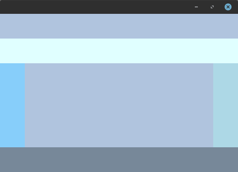
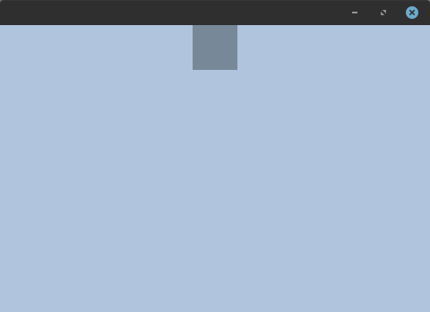
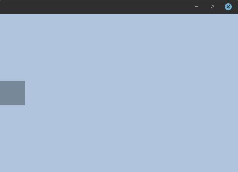
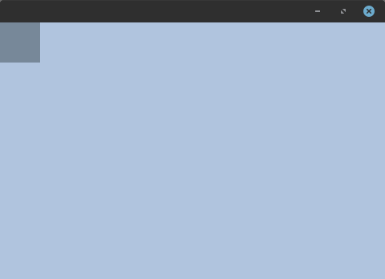

+++
title = "Anchor layout"
date = 2024-10-04T19:45:29+03:00
weight = 1
+++

Anchor layout allows the child containers to be anchored to a specific constraint.


{}
```go
package main

import (
	"github.com/ebitenui/ebitenui"
	"github.com/ebitenui/ebitenui/image"
	"github.com/ebitenui/ebitenui/widget"
	"github.com/hajimehoshi/ebiten/v2"
	"golang.org/x/image/colornames"
)

func main() {
	ebiten.SetWindowSize(480, 320)
	ebiten.SetWindowResizingMode(ebiten.WindowResizingModeEnabled)
	if err := ebiten.RunGame(NewGame()); err != nil {
		panic(err)
	}
}

type Game struct {
	ui *ebitenui.UI
}

func NewGame() *Game {
	left := widget.NewContainer(
		widget.ContainerOpts.BackgroundImage(
			image.NewNineSliceColor(colornames.Lightskyblue),
		),
		widget.ContainerOpts.WidgetOpts(
			widget.WidgetOpts.LayoutData(widget.AnchorLayoutData{
				HorizontalPosition: widget.AnchorLayoutPositionStart,
				StretchVertical:    true,
			}),
			widget.WidgetOpts.MinSize(50, 50),
		),
	)
	right := widget.NewContainer(
		widget.ContainerOpts.BackgroundImage(
			image.NewNineSliceColor(colornames.Lightblue),
		),
		widget.ContainerOpts.WidgetOpts(
			widget.WidgetOpts.LayoutData(widget.AnchorLayoutData{
				HorizontalPosition: widget.AnchorLayoutPositionEnd,
				StretchVertical:    true,
			}),
			widget.WidgetOpts.MinSize(50, 50),
		),
	)
	up := widget.NewContainer(
		widget.ContainerOpts.BackgroundImage(
			image.NewNineSliceColor(colornames.Lightcyan),
		),
		widget.ContainerOpts.WidgetOpts(
			widget.WidgetOpts.LayoutData(widget.AnchorLayoutData{
				VerticalPosition:  widget.AnchorLayoutPositionStart,
				StretchHorizontal: true,
			}),
			widget.WidgetOpts.MinSize(50, 50),
		),
	)
	down := widget.NewContainer(
		widget.ContainerOpts.BackgroundImage(
			image.NewNineSliceColor(colornames.Lightslategrey),
		),
		widget.ContainerOpts.WidgetOpts(
			widget.WidgetOpts.LayoutData(widget.AnchorLayoutData{
				VerticalPosition:  widget.AnchorLayoutPositionEnd,
				StretchHorizontal: true,
			}),
			widget.WidgetOpts.MinSize(50, 50),
		),
	)
	root := widget.NewContainer(
		widget.ContainerOpts.BackgroundImage(
			image.NewNineSliceColor(colornames.Lightsteelblue),
		),
		widget.ContainerOpts.Layout(widget.NewAnchorLayout()),
	)
	root.AddChild(left)
	root.AddChild(right)
	root.AddChild(up)
	root.AddChild(down)

	return &Game{
		ui: &ebitenui.UI{Container: root},
	}
}

func (g *Game) Update() error {
	g.ui.Update()
	return nil
}

func (g *Game) Draw(screen *ebiten.Image) {
	g.ui.Draw(screen)
}

func (g *Game) Layout(w, h int) (int, int) {
	return w, h
}
```
{}

### Layout options

###### Padding

Layout allows you to specify padding for all child elements but not the itself.


{}
```go
root := widget.NewContainer(
    widget.ContainerOpts.Layout(widget.NewAnchorLayout(
        widget.AnchorLayoutOpts.Padding(widget.Insets{
            Left: 50,
        }),
    )),
)
```

{}
{}
```go
root := widget.NewContainer(
    widget.ContainerOpts.Layout(widget.NewAnchorLayout(
        widget.AnchorLayoutOpts.Padding(widget.Insets{
            Right: 50,
        }),
    )),
)
```

{}
{}
```go
root := widget.NewContainer(
    widget.ContainerOpts.Layout(widget.NewAnchorLayout(
        widget.AnchorLayoutOpts.Padding(widget.Insets{
            Top: 50,
        }),
    )),
)
```

{}
{}
```go
root := widget.NewContainer(
    widget.ContainerOpts.Layout(widget.NewAnchorLayout(
        widget.AnchorLayoutOpts.Padding(widget.Insets{
            Bottom: 50,
        }),
    )),
)
```

{}


### Layout data

###### Horizontal position

Responsible for aligning the element along the horizontal axis.


{}
```go
child := widget.NewContainer(
    widget.ContainerOpts.WidgetOpts(
        widget.WidgetOpts.LayoutData(widget.AnchorLayoutData{
            HorizontalPosition: widget.AnchorLayoutPositionCenter,
        }),
    ),
)
```

{}
{}
```go
child := widget.NewContainer(
    widget.ContainerOpts.WidgetOpts(
        widget.WidgetOpts.LayoutData(widget.AnchorLayoutData{
            HorizontalPosition: widget.AnchorLayoutPositionStart,
        }),
    ),
)
```

{}
{}
```go
child := widget.NewContainer(
    widget.ContainerOpts.WidgetOpts(
        widget.WidgetOpts.LayoutData(widget.AnchorLayoutData{
            HorizontalPosition: widget.AnchorLayoutPositionEnd,
        }),
    ),
)
```

{}


###### Vertical position

Responsible for aligning the element along the vertical axis.


{}
```go
child := widget.NewContainer(
    widget.ContainerOpts.WidgetOpts(
        widget.WidgetOpts.LayoutData(widget.AnchorLayoutData{
            HorizontalPosition: widget.AnchorLayoutPositionCenter,
        }),
    ),
)
```

{}
{}
```go
child := widget.NewContainer(
    widget.ContainerOpts.WidgetOpts(
        widget.WidgetOpts.LayoutData(widget.AnchorLayoutData{
            HorizontalPosition: widget.AnchorLayoutPositionStart,
        }),
    ),
)
```

{}
{}
```go
child := widget.NewContainer(
    widget.ContainerOpts.WidgetOpts(
        widget.WidgetOpts.LayoutData(widget.AnchorLayoutData{
            HorizontalPosition: widget.AnchorLayoutPositionEnd,
        }),
    ),
)
```

{}

