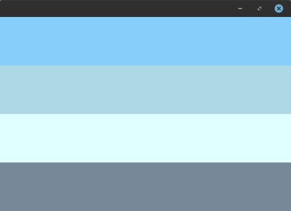
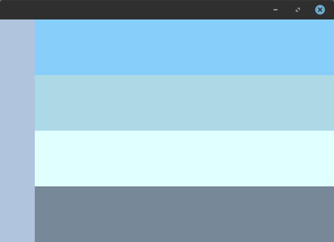
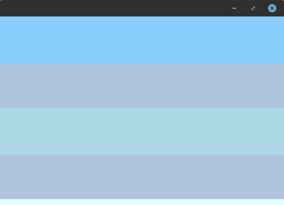
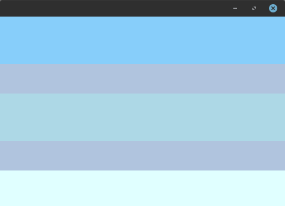
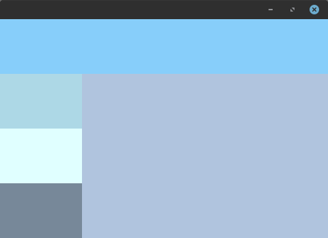
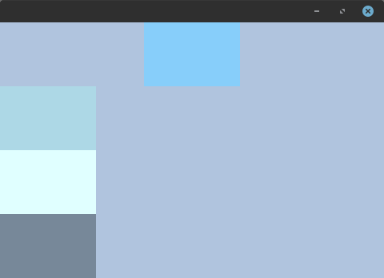
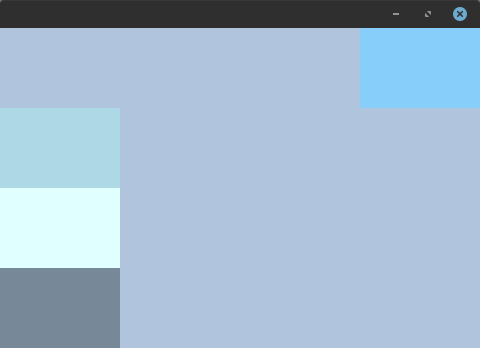
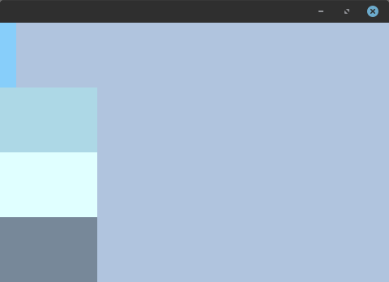

+++
title = "Row layout"
date = 2024-10-04T19:45:29+03:00
weight = 2
+++

Row layout places all child containers in one row or column. It can be useful for creating lists of widgets.


{}
```go
package main

import (
	"github.com/ebitenui/ebitenui"
	"github.com/ebitenui/ebitenui/image"
	"github.com/ebitenui/ebitenui/widget"
	"github.com/hajimehoshi/ebiten/v2"
	"golang.org/x/image/colornames"
)

func main() {
	ebiten.SetWindowSize(480, 320)
	ebiten.SetWindowResizingMode(ebiten.WindowResizingModeEnabled)
	if err := ebiten.RunGame(NewGame()); err != nil {
		panic(err)
	}
}

type Game struct {
	ui *ebitenui.UI
}

func NewGame() *Game {
	a := widget.NewContainer(
		widget.ContainerOpts.BackgroundImage(
			image.NewNineSliceColor(colornames.Lightskyblue),
		),
		widget.ContainerOpts.WidgetOpts(
			widget.WidgetOpts.LayoutData(widget.RowLayoutData{
				Stretch: true,
			}),
			widget.WidgetOpts.MinSize(50, 80),
		),
	)
	b := widget.NewContainer(
		widget.ContainerOpts.BackgroundImage(
			image.NewNineSliceColor(colornames.Lightblue),
		),
		widget.ContainerOpts.WidgetOpts(
			widget.WidgetOpts.LayoutData(widget.RowLayoutData{
				Stretch: true,
			}),
			widget.WidgetOpts.MinSize(50, 80),
		),
	)
	c := widget.NewContainer(
		widget.ContainerOpts.BackgroundImage(
			image.NewNineSliceColor(colornames.Lightcyan),
		),
		widget.ContainerOpts.WidgetOpts(
			widget.WidgetOpts.LayoutData(widget.RowLayoutData{
				Stretch: true,
			}),
			widget.WidgetOpts.MinSize(50, 80),
		),
	)
	d := widget.NewContainer(
		widget.ContainerOpts.BackgroundImage(
			image.NewNineSliceColor(colornames.Lightslategrey),
		),
		widget.ContainerOpts.WidgetOpts(
			widget.WidgetOpts.LayoutData(widget.RowLayoutData{
				Stretch: true,
			}),
			widget.WidgetOpts.MinSize(50, 80),
		),
	)
	root := widget.NewContainer(
		widget.ContainerOpts.BackgroundImage(
			image.NewNineSliceColor(colornames.Lightsteelblue),
		),
		widget.ContainerOpts.Layout(widget.NewRowLayout(
			widget.RowLayoutOpts.Direction(
				widget.DirectionVertical,
			),
		)),
	)
	root.AddChild(a)
	root.AddChild(b)
	root.AddChild(c)
	root.AddChild(d)

	return &Game{
		ui: &ebitenui.UI{Container: root},
	}
}

func (g *Game) Update() error {
	g.ui.Update()
	return nil
}

func (g *Game) Draw(screen *ebiten.Image) {
	g.ui.Draw(screen)
}

func (g *Game) Layout(w, h int) (int, int) {
	return w, h
}
```
{}

### Layout options

###### Direction

Responsible for whether child containers will follow each other in rows or columns.


{}
```go
root := widget.NewContainer(
    widget.ContainerOpts.Layout(widget.NewRowLayout(
        widget.RowLayoutOpts.Direction(
            widget.DirectionHorizontal,
        ),
    )),
)
```

{}
{}
```go
root := widget.NewContainer(
    widget.ContainerOpts.Layout(widget.NewRowLayout(
        widget.RowLayoutOpts.Direction(
            widget.DirectionVertical,
        ),
    )),
)
```

{}


###### Padding

Layout allows you to specify padding for all child elements but not the itself.

Please note that `Right` and `Bottom` padding works depending on the direction.


{}
```go
root := widget.NewContainer(
    widget.ContainerOpts.Layout(widget.NewRowLayout(
        widget.RowLayoutOpts.Padding(widget.Insets{
            Left: 50,
        }),
    )),
)
```


{}
{}
```go
root := widget.NewContainer(
    widget.ContainerOpts.Layout(widget.NewRowLayout(
        widget.RowLayoutOpts.Padding(widget.Insets{
            Right: 50,
        }),
    )),
)
```


{}
{}
```go
root := widget.NewContainer(
    widget.ContainerOpts.Layout(widget.NewRowLayout(
        widget.RowLayoutOpts.Padding(widget.Insets{
            Top: 50,
        }),
    )),
)
```


{}
{}
```go
root := widget.NewContainer(
    widget.ContainerOpts.Layout(widget.NewRowLayout(
        widget.RowLayoutOpts.Padding(widget.Insets{
            Bottom: 50,
        }),
    )),
)
```


{}


###### Spacing

Layout allows you to specify padding for all child elements but not the itself.


{}
```go
root := widget.NewContainer(
    widget.ContainerOpts.Layout(widget.NewRowLayout(
        widget.RowLayoutOpts.Spacing(75),
    )),
)
```

{}
{}
```go
root := widget.NewContainer(
    widget.ContainerOpts.Layout(widget.NewRowLayout(
        widget.RowLayoutOpts.Spacing(50),
    )),
)
```

{}
{}
```go
root := widget.NewContainer(
    widget.ContainerOpts.Layout(widget.NewRowLayout(
        widget.RowLayoutOpts.Spacing(25),
    )),
)
```

{}
{}
```go
root := widget.NewContainer(
    widget.ContainerOpts.Layout(widget.NewRowLayout(
        widget.RowLayoutOpts.Spacing(0),
    )),
)
```

{}


### Layout data

###### Stretch

Responsible for stretching the element along the entire length of the opposite axis.


{}
```go
child := widget.NewContainer(
    widget.ContainerOpts.WidgetOpts(
        widget.WidgetOpts.LayoutData(widget.RowLayoutData{
            Stretch: true,
        }),
    ),
)
```

{}
{}
```go
child := widget.NewContainer(
    widget.ContainerOpts.WidgetOpts(
        widget.WidgetOpts.LayoutData(widget.RowLayoutData{
            Stretch: false,
        }),
    ),
)
```

{}


###### Position

Responsible for aligning the element along the opposite axis if it is not stretched.


{}
```go
child := widget.NewContainer(
    widget.ContainerOpts.WidgetOpts(
        widget.WidgetOpts.LayoutData(widget.RowLayoutData{
            Position: widget.RowLayoutPositionCenter,
        }),
    ),
)
```

{}
{}
```go
child := widget.NewContainer(
    widget.ContainerOpts.WidgetOpts(
        widget.WidgetOpts.LayoutData(widget.RowLayoutData{
            Position: widget.RowLayoutPositionStart,
        }),
    ),
)
```

{}
{}
```go
child := widget.NewContainer(
    widget.ContainerOpts.WidgetOpts(
        widget.WidgetOpts.LayoutData(widget.RowLayoutData{
            Position: widget.RowLayoutPositionEnd,
        }),
    ),
)
```

{}



###### Max size

Responsible for the allowable size of the container.


{}
```go
child := widget.NewContainer(
    widget.ContainerOpts.WidgetOpts(
        widget.WidgetOpts.LayoutData(widget.RowLayoutData{
            MaxWidth: 20,
        }),
    ),
)
```

{}
{}
```go
child := widget.NewContainer(
    widget.ContainerOpts.WidgetOpts(
        widget.WidgetOpts.LayoutData(widget.RowLayoutData{
            MaxHeight: 20,
        }),
    ),
)
```

{}

